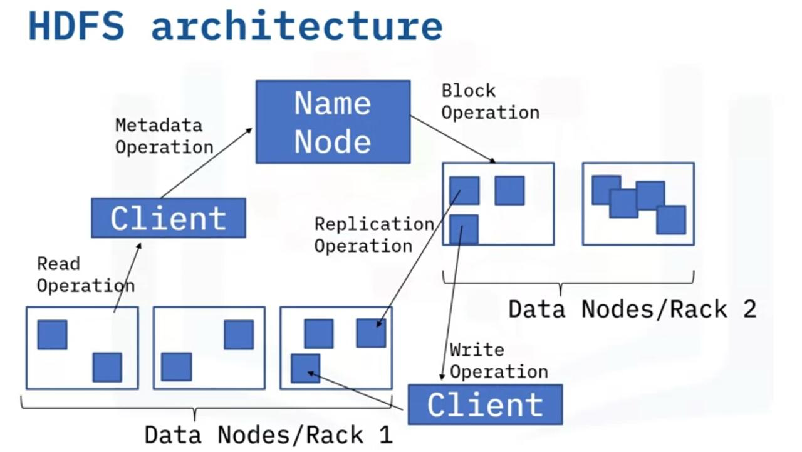

# HDFS

- Hadoop Distributed File System
- It is a storage layer of Hadoop
- Splits files into blocks, creates replicas of blocks and stores them on different machines
- Provides access to streaming data
- HDFS uses a command line interface to interact with Hadoop

**Streaming means that HDFS provides a constant bitrate when transferring data rather than having the data being transferred in waves**

## Key Features

- **Cost Efficient** - The storage hardware is not expensive
- **Large amount of data** - HDFS can store upto petabytes of data
- **Replication** - Makes pieces of data on multiple machines
- **Fault Tolerant** - If one machine crashes, a copy of the data can be found somewhere else and work continues
- **Scalable** - One cluster can be scaled into hundreds of nodes
- **Portable** - Can easily move across multiple platforms

## HDFS Concepts

### 1. Blocks 

- When HDFS receives files, files are broken into smaller chunks called blocks
- Min amount of data that can be read or written 
- Provides fault tolerance
- Default size is 64 MB or 128 MB

**Example** 
Given:

- File Size (500 MB)
- Default block size = 128 MB

| Chunk A | Chunk B | Chunk C | Chunk D |
|---------|---------|---------|---------|
| 128 MB  | 128 MB  | 128 MB  | 116 MB  |

### 2. Nodes

Node is a single system which is responsible to store and process data

#### 1. Primary Node (Name Node):

- This node regulates file access to the clients and manitains, manages and assigns task to secondary node

#### 2. Secondary Node (Data Node):

- These nodes are actual workers in HDFS system and take instructions from the primary node

### 3. Rack Awareness in HDFS

- When performing operations like read and write, it is important that the name node maximize performance by choosing the data nodes closest

- This could be by choosing data nodes on same rack or nearby racks. This is called as Rack Awareness

**A Rack is the collection of about 40 to 50 data nodes using the same network switch**

- Improves cluster performance by reducing network traffic
- Name node keeps rack ID information
- Replication can be done through rack awareness

### 4. Replication

- HDFS uses rack awareness concept to create replicas to make sure that the data is reliable and available and that the network bandwidth is properly utilized
- Creates copy of data block
- Copies are created for backup purposes
- **Replication factor** : Number of times the data block was copied

**Replication Example**

File Size = 500 MB

| Chunk A (128 MB) | Chunk B (128 MB) | Chunk C (128 MB) | Chunk D (116 MB) |
|------------------|------------------|------------------|------------------|
| Chunk A  Chunk B | Chunk B  Chunk D | Chunk A  Chunk D | Chunk B  Chunk C |
| Copy 1   Copy 2  | Copy 1   Copy 2  | Copy 1   Copy 2  | Copy 1   Copy 2  |


```
+-------------+   +-------------+   +-------------+   +-------------+
|   Rack 1    |   |   Rack 2    |   |   Rack 3    |   |   Rack 4    |
|             |   |             |   |             |   |             |    
|  Chunk A    |   |  Chunk B    |   |  Chunk D    |   |  Chunk C    |
|   Copy 1    |   |   Copy 1    |   |   Copy 2    |   |   Copy 2    |
|             |   |             |   |             |   |             |
|  Chunk B    |   |  Chunk C    |   |  Chunk A    |   |  Chunk D    |
|   Copy 2    |   |   Copy 1    |   |   Copy 2    |   |   Copy 1    |
+-------------+   +-------------+   +-------------+   +-------------+
```

### 5. Read and Write Operations

- HDFS allows write once read many operations

#### Read
- Client will send a request to the primary node to get the location of the data nodes containing blocks
- Client will read files closest to the data nodes

#### Write
- The name node makes sure that file doesn't exist
- If file exists client gets on **IO Exception** messages
- If the file doesn't exist, the client is given access to start writing files

**Client fulfills a user's request by interacting with the Name node and Data nodes**

## Hadoop Architecture



- Hadoop follows a concept of primary/secondary node architecture
- The architecture is such that per cluster, there is one name node and multiple data nodes
- Internally, a file is split into one or more blocks and these blocks are stored in a set of data nodes
- The name node oversees opening, closing, renaming file operations and mapping file blocks to the data node 
- The data nodes are responsible for read and write requests from the client and peform the creation, replication and deletion of file blocks based on instructions from name node