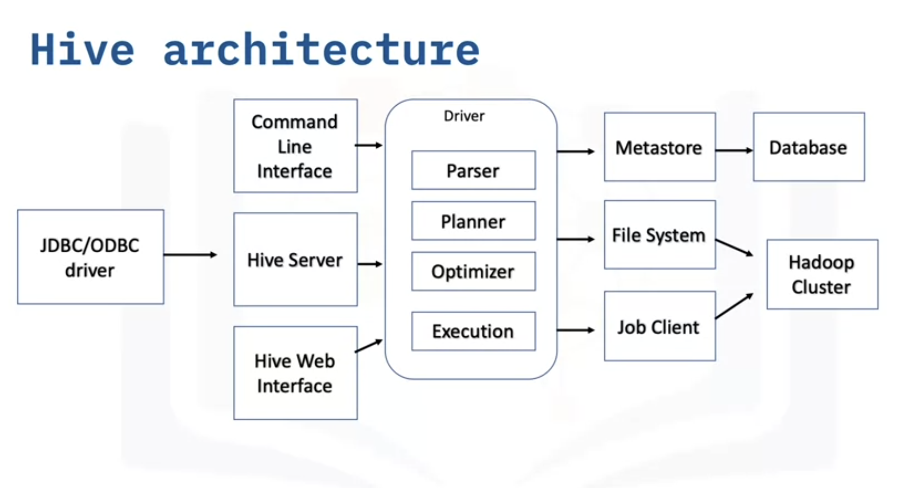

# Hive

- Hive is data warehouse software within Hadoop that is designed for reading, writing and managing tabular-type datasets and data analysis
- It is scalable, fast and easy to use
- Hive Query Language (HiveQL) is inspired by SQL, making it easier for users to grasp concepts
- It supports data cleansing and filtering depending on user's requirements

**A data warehouse stores historical data from many different sources so that you can analyze and extract insights from it**

## Hive and Traditional RDBMS Compared

### Traditional RDBMS

- Used to maintain a database and uses SQL
- Suited for real-time/dynamic data analysis like data from sensors
- Designed to read and write as many times as needs
- Maximum data size it can handle is ```terabyte```
- Enforces that the schema must verify loading data before it can proceed
- May not always have built-in for support data partitioning

### Hive

- Used to maintain a data warehouse using Hive query language
- Suited for static data analysis like a text file containing names
- Designed on the methodology of write once and read many 
- Max data size it can handle is petabyte
- Doesn't enforce the schema to verify loading data
- Supports partitioning

## Hive Architecture


### 1. Hive Client
- JDBC clients allow Java applications to connect to Hive
- ODBC client allows applications based on ODBC to connect to Hive

### 2. Hive Services
```Incharge of the performing queries```
- Hive server is used to run queries and allows multiple clients to submit requests
- It is built to support the JDBC and ODBC clients
- The driver receives query statements submitted through the command line and sends query to compiler after initiating a session
- The optimizer performs transformations on the execution plan and splits the tasks to help speed up and improve efficiency
- The executor executes tasks after the optimizerhas split the tasks

### 3. Hive Storage and Computing
- Metastore stores the metadata information about the tables and incharge of keeping this information in central place