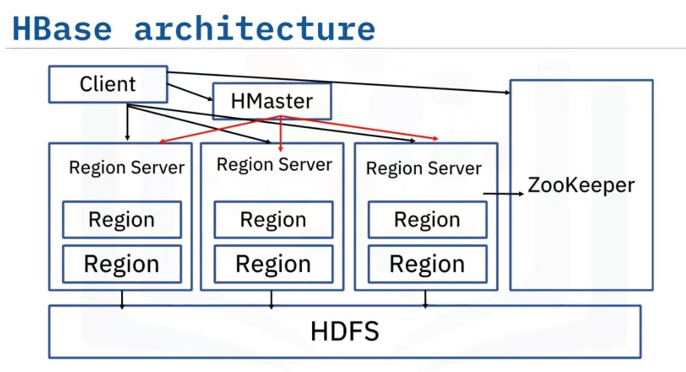

# HBase

- Column-oriented non-relational database management system
- HBase runs on top of Hadoop
- Provides a fault-tolerant way of storing sparse datasets
- Works well with real-time data and random read and write access to Big Data

## HBase Features

- HBase is used for write heavy applications
- HBase is linearly and modularly scalable
- It is a backup support for MapReduce jobs
- It provides consistent reads and writes
- It has no fixed column schema
- It is an easy-to-use java API for client access
- It provides data replication across cluster

### Few things to note
- Predefine the table schema and specify column families
- New columns can be added to column families at anytime
- HBase schema is very flexible
- HBase has master nodes to manage the cluster and region servers to perform the work

## Difference between HBase and HDFS

### HBase

- HBase stores data in the form of columns and rows in a table
- HBase allows dynamic changes
- HBase is suitable for random writes and reads of data stored in HDFS
- HBase allows for storing and processing of Big Data

### HDFS

- HDFS stores the data in distributed manner across different nodes on that network
- HDFS has a rigid architecture that doesn't allow changes
- HDFS is suited for write once and read many times
- HDFS is for storing only

## HBase Architecture

### HBase

- HBase sits on top of HDFS
- HDFS provides a distributed environment for the storage and it is a file system designed to run on commodity hardware
- It stores each file in multiple blocks and to maintain fault tolerance, it replicates the blocks across a Hadoop cluster

### HMaster

- It is a master server
- It monitors the region server instances
- Assigns regions to region servers, and distributes services to different region servers
- Manages any changes that are made to the schema and metadata operations

### Region Servers

- Receives read and write requests from the client and assign the request to a specific region where the column family resides
- They are responsible for serving and managing regions that are present in a distributed cluster
- Communications directly with the client to facilitate requests

### Region

- Smallest unit of HBase cluster 
- Contains multiple stores
- Two components - Hfile & Memstore

### ZooKeeper

- Centralized service for maintaining configuration information to maintain healthy links between nodes
- Provides distributed synchonization
- Tracks server failure and network partitions by triggering an error message and then starts repairing the failed nodes